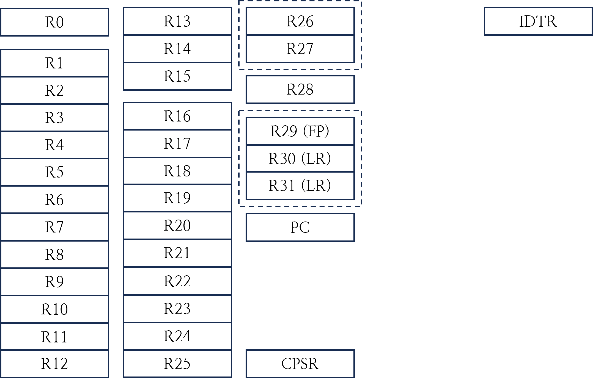
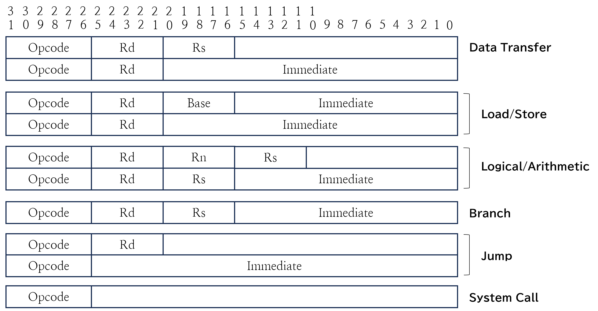

이 레포지토리는 AMO CPU에 대한 구현과 이 CPU가 실제로 동작하기 위해 필요한 여러 구현들 (Controller, Motherboard)을 가지고 있습니다.

[English](README.md) · [**한국어**](README_ko.md)

# AMOv1
AMO는 완전히 처음부터 설계된 `32-bit RISC CPU`로 시분할 시스템을 동작시키기 위한 모든 기능들을 제공합니다.

```
AMOv1
 ├─ RegisterFile (RegisterFile.v)                           # Registers (32 + PC + CPSR + IDTR)
 ├─ OpcodeToALUOpcode (OpcodeToALUOpcode.v)                 # Translate opcode to ALU-opcode
 ├─ ALU (ALU.v)                                             # Logic unit
 ├─ Condition (Condition.v)                                 # Check if this branch is true using CPSR
 ├─ ControlUnit (ControlUnit.v)                             # Micro-controller (hard-wired)
 └─ MemoryHandler (MemoryHandler.v)                         # Unaligned load 2-beat merge
```

### AMO Ports

| Signal     | Dir | Width | Desc                  |
|------------|-----|-------|-----------------------|
| CLK        | in  | 1     | Clock                 |
| RST        | in  | 1     | Reset                 |
| INT        | in  | 1     | Interrupt             |
| RDINT      | out | 1     | Interrupt acknowledge |
| Din        | in  | 32    | Data-In               |
| WR         | out | 4     | Byte write mask       |
| Aout       | out | 32    | Address-Out           |
| Dout       | out | 32    | Data-Out              |

### Registers



| Register   | Special | Width  | Notes                                |
|------------|---------|--------|--------------------------------------|
| R0         |         | 32-bit | Caller-saved/Result register         |
| R1-R15     |         | 32-bit | Caller-saved registers               |
| R16-R25    |         | 32-bit | Callee-saved registers               |
| R26-R27    |         | 32-bit | Interrupt registers                  |
| R28        |         | 32-bit | Argument register                    |
| R29        | FP      | 32-bit | Frame pointer                        |
| R30        | SP      | 32-bit | Stack pointer                        |
| R31        | LR      | 32-bit | Link register                        |
| PC         |         | 32-bit | Program Counter                      |
| CPSR       |         | 4-bit  | Current Program Status Register      |
| IDTR       |         | 32-bit | Interrupt Descriptor Table Register  |

PC와 CPSR은 사용자가 사용할 수 없으며, CPU 내부적으로 사용됩니다. IDTR은 `setvt`를 통해 설정할 수 있으며, Interrupt가 발생했을 때 이 레지스터를 참조하여 jump합니다. 해당 Instruction은 [ISA.pdf](https://github.com/Lamune-Amo/Document/blob/master/ISA.pdf)에서 확인할 수 있습니다.

### Interrupt Vectors

| Type         | Offset |
|--------------|--------|
| Reset        | 0x0    |
| Undefined    | 0x4    |
| IRQ          | 0x8    |
| SWI          | 0xC    |

CPU는 `INT`가 SET되거나 `SWI`를 수행할 때, IDTR를 통해 Interrupt Descriptor Table 위치를 찾고 offset을 더해 handler의 주소를 알 수 있습니다.
IDTR은 초기에 `0x0`이므로 ROM 내의 Interrupt Vector를 참조합니다.

### Instruction Set



| Mnemonic | Instruction Format | Operation |
| -------- | ------------------ | --------- |
| **MOV** | `mov Rd, Rs/imm21` | `Rd ← Rs/imm21` |
| | `mov Rd, imm32/symbol` | `Rd ← imm32/symbol` |
| **LDR** | `ldr Rd, [base, offset]` | `Rd ← mem[base + offset]` |
| | `ldr Rd, [relative]` | `Rd ← mem[pc + relative]` |
| **STR** | `str [base, offset], Rs` | `mem[base + offset] ← Rs` |
| | `str [relative], Rs` | `mem[pc + relative] ← Rs` |
| **LDRB** | `ldrb Rd, [base, offset]` | `Rd ← mem[base + offset]` |
| | `ldrb Rd, [relative]` | `Rd ← mem[pc + relative]` |
| **STRB** | `strb [base, offset], Rs` | `mem[base + offset] ← Rs` |
| | `strb [relative], Rs` | `mem[pc + relative] ← Rs` |
| **LDRH** | `ldrh Rd, [base, offset]` | `Rd ← mem[base + offset]` |
| | `ldrh Rd, [relative]` | `Rd ← mem[pc + relative]` |
| **STRH** | `strh [base, offset], Rs` | `mem[base + offset] ← Rs` |
| | `strh [relative], Rs` | `mem[pc + relative] ← Rs` |
| **ADD** | `add Rd, Rn, Rs/imm16` | `Rd ← Rn + Rs/imm16` |
| **ADC** | `adc Rd, Rn, Rs/imm16` | `Rd ← Rn + Rs/imm16 + Carry` |
| **SUB** | `sub Rd, Rn, Rs/imm16` | `Rd ← Rn - Rs/imm16` |
| **AND** | `and Rd, Rn, Rs/imm16` | `Rd ← Rn AND Rs/imm16` |
| **OR** | `or Rd, Rn, Rs/imm16` | `Rd ← Rn OR Rs/imm16` |
| **XOR** | `xor Rd, Rn, Rs/imm16` | `Rd ← Rn XOR Rs/imm16` |
| **NOT** | `not Rd, Rs/imm16` | `Rd ← NOT Rs/imm16` |
| **LSL** | `lsl Rd, Rn, Rs/imm16` | `Rd ← Rn << Rs/imm16` |
| **LSR** | `lsr Rd, Rn, Rs/imm16` | `Rd ← Rn >> Rs/imm16` |
| **ASR** | `asr Rd, Rn, Rs/imm16` | `Rd ← Rn >>> Rs/imm16` |
| **BEQ** | `beq Rd, Rs, imm16` | `PC ← PC + (imm16 << 2)` if `Rd == Rs` |
| **BNE** | `bne Rd, Rs, imm16` | `PC ← PC + (imm16 << 2)` if `Rd != Rs` |
| **BLT** | `blt Rd, Rs, imm16` | `PC ← PC + (imm16 << 2)` if `Rd < Rs` |
| **BLE** | `ble Rd, Rs, imm16` | `PC ← PC + (imm16 << 2)` if `Rd <= Rs` |
| **BLTU** | `bltu Rd, Rs, imm16` | `PC ← PC + (imm16 << 2)` if `Rs < Rn` |
| **BLEU** | `bleu Rd, Rs, imm16` | `PC ← PC + (imm16 << 2)` if `Rs <= Rn` |
| **JMP** | `jmp Rs/imm26` | `PC = Rs/(imm26 << 2)` |
| **JAL** | `jal Rs/imm26` | `PC = (imm26 << 2), LR = PC` |
| **SWI** | `swi imm6` | `Jump to Interrupt Vector (Trap)` |
| **EXT** | `ext Rd, Rs, Opt` | `Rd ← [Sign/Unsign]Extend (Rs)` |
| **SETVT** | `setvt Rs, Type` | `Set the Vector Table` |
| **RET** | `ret Rs` | `PC = Rs/(imm26 << 2), InterruptBlocking = false` |
| **LOCK** | `lock` | `InterruptBlocking = !InterruptBlocking` |

### Atomic Instruction

AMO는 우회적이지만, 강력한 Atomic 연산을 제공합니다. 사용자는 `lock` instruction을 통해 Control Unit 내부에 있는 `INTBlockWriteEn` bit를 반전시킬 수 있습니다.
`INTBlockWriteEn`가 `1`인 동안 Control Unit은 외부에서 들어오는 INT를 무시하고, clear하지 않습니다.
이 방법으로 사용자는 제한 없는 원자 연산을 구현할 수 있습니다.

### Memory Access

최대 4-bytes 단위로 메모리에 접근할 수 있으며, CPU 입장에서 **clock 지연 없이 unaligned address에 자유롭게 접근할 수 있습니다.**
CPU 내의 `MemoryHandler` 모듈을 통해 ControlUnit이 메모리 접근을 제어합니다.

## Motherboard

`Motherboard`는 실제로 AMO가 동작하는데 필요한 요소들과 구성을 가지고 있습니다. 이 구성에서 AMO는 하나의 Module로 존재하며, Motherboard는 실제로 PL에 얹어지는 `TOP Module`이 됩니다.
현재는 PS2 Keyboard와 VGA를 지원하고 있으며, Timer를 통해 시분할 시스템을 위한 Scheduling을 구현할 수 있습니다.
아래 구성에서 `ROM`, `RAM`, `ClockingWizard`는 IP를 사용하였으며, 나머지는 직접 구현하여 제공합니다.

```
Motherboard
 ├─ AMO (AMO.v)                                             # CPU
 ├─ InterruptController (InterruptController.v)             # Interrupt (Timer + PS2 keyboard)
 ├─ Graphics (Graphics.v)                                   # VGA
 ├─ PS2Controller (PS2Controller.v)                         # PS2 Keyboard
 ├─ Timer (Timer.v)                                         # Interrupt for scheduling + Time
 ├─ ROM (dist_mem_gen_0.xci wrapper, firmware image)        # ROM
 ├─ RAM (blk_mem_ram.xci wrapper)                           # RAM
 └─ ClockingWizard (clk_wiz_0)                              # timing for VGA
```

### Motherboard Ports

| Signal     | Dir | Width | Desc                  |
|------------|-----|-------|-----------------------|
| CLK        | in  | 1     | CPU clock             |
| DCLK       | in  | 1     | VGA + RAM clock       |
| RST        | in  | 1     | Reset                 |
| HSYNC      | out | 1     | VGA hsync             |
| VSYNC      | out | 1     | VGA vsync             |
| RGB        | out | 12    | VGA RGB[11:0]         |
| PS2CLOCK0  | in  | 1     | PS/2 keyboard clock   |
| PS2DATA0   | in  | 1     | PS/2 keyboard data    |

### Memory Map

| Region    | Address (hex)              | Size (bytes)      | Notes              |
| --------- | -------------------------- | ----------------- | ------------------ |
| ROM       | 0x0000_0000 .. 0x0000_0FFF | 4,096 (0x1000)    | Firmware           |
| VIDEO RAM | 0x0000_1000 .. 0x0000_22BF | 4,800 (0x12C0)    | Video RAM (in/out) |
| PS/2      | 0x0000_22C4 .. 0x0000_22C7 | 4 (0x4)           | Keyboard           |
| TIMER     | 0x0000_22C8 .. 0x0000_22CB | 4 (0x4)           | Timer              |
| INTC      | 0x0000_22C0 .. 0x0000_22C3 | 4 (0x4)           | Interrupt (INT0/1) |
| RAM       | 0x0000_2400 .. 0x0002_A3FF | 163,840 (0x28000) | Data               |

AMO는 Memory Mapped IO를 사용하하므로 위 Mapping에 따라 필요한 정보/장비에 접근할 수 있습니다. 접근은 주소에 상관없이 **1 clock**만을 사용합니다.

## VGA Controller

`VGA Controller`는 내부적으로 가지고 있는 Video RAM을 읽고, 모니터가 인식할 수 있는 형태로 전송합니다. 현재는 CLI 기반의 처리만 제공하고 있으며, 한 글자에 2-bytes를 사용합니다.

```
Graphics
 ├─ VGAController (VGAController.v)                         # VGA Controller
 ├─ ForegroundPalette (Palette.v)                           # Foreground
 ├─ BackgroundPalette (Palette.v)                           # Background
 ├─ ASCIIRom (ASCIIRom.v)                                   # Character Shape
 └─ RAM (dist_mem_video.xci wrapper)                        # Video RAM
```

Video RAM의 format은 아래와 같습니다.

| 4-bit      | 4-bit      | 8-bit      |
| ---------  | ---------- | ---------- |
| foreground | background | character  |

색상은 아래와 같이 **16가지**를 지원합니다.

| Value | Color         | RGB         |
| ----- | ------------- | ----------- |
| 0     | Black         | 0 0 0       |
| 1     | Blue          | 0 0 170     |
| 2     | Green         | 0 170 0     |
| 3     | Cyan          | 0 170 170   |
| 4     | Red           | 170 0 0     |
| 5     | Magenta       | 170 0 170   |
| 6     | Brown         | 170 85 0    |
| 7     | White         | 170 170 170 |
| 8     | Gray          | 85 85 85    |
| 9     | Light Blue    | 85 85 255   |
| A     | Light Green   | 85 255 85   |
| B     | Light Cyan    | 85 255 255  |
| C     | Light Red     | 255 85 85   |
| D     | Light Magenta | 255 85 255  |
| E     | Yellow        | 255 255 85  |
| F     | Bright White  | 255 255 255 |

문자는 ASCII를 모두 지원하며, 추가적으로 몇 가지 특수문자를 지원합니다.